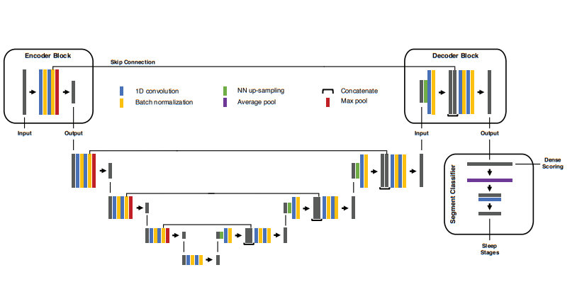

# U-ECG-Time

This repository contains an implementation of ECG signal segmentation using the U-Time architecture proposed by M. Perslev et al. [Click for paper!](https://arxiv.org/pdf/1910.11162). It is an unofficial implementation of the original paper, with small modifications due to differences in the datasets used. While the original study applied this approach to EEG data for sleep staging, my project focuses on ECG data for arrhythmia detection.

## Important Information

This repository will be updated with the results of my research project, which approaches the same problem from a slightly different perspective. However, these updates will be released after the review process is completed. In the meantime, I am presenting the results of my side project.

## U-Net inspiratons

This model is a modification of the well-known U-Net architecture, initially designed for semantic segmentation of 2D data. Adapting it for time-series data required rethinking the entire architecture, including parameters and implementation details.

A crucial step was preparing the dataset correctly while considering the dataset’s specific characteristics. Most arrhythmia detection research focuses solely on isolated heartbeat segments, requiring complex preprocessing. Using a segmentation model allows for analyzing longer signal fragments, providing context for each heartbeat by considering preceding and following beats. This approach also reduces preprocessing to simply identifying R-peaks.

## Focal Loss

Instead of treating this problem purely as a segmentation task, I also drew from object detection methods by implementing Focal Loss, as proposed by Lin et al. in 2017 [Click for paper!](https://arxiv.org/pdf/1708.02002v2). Focal Loss is designed to address class imbalance, making it a perfect fit for this task, where certain heartbeat types occur far more frequently than others.

## Achievements

1. ECG signal segmentation inspired by the U-Net model and its adaptation for EEG segmentation in the U-Time study.
2. ECG segmentation offers significant advantages over simple classification of individual beats by simplifying preprocessing and preserving heartbeat context.
3. Achieved results: x%, y% (to be updated).

## To-do list:

1. Test on other medical and non-medical time-series datasets.
2. Make the implementation fully modular, allowing users to choose the number of encoder and decoder layers.